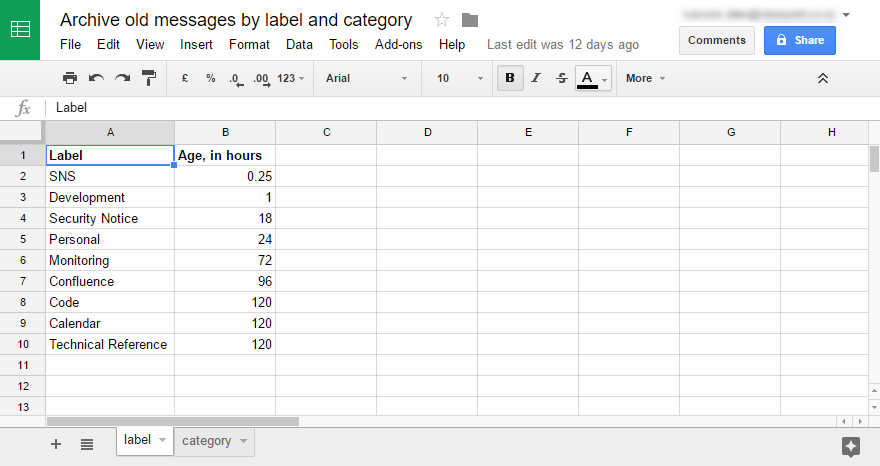
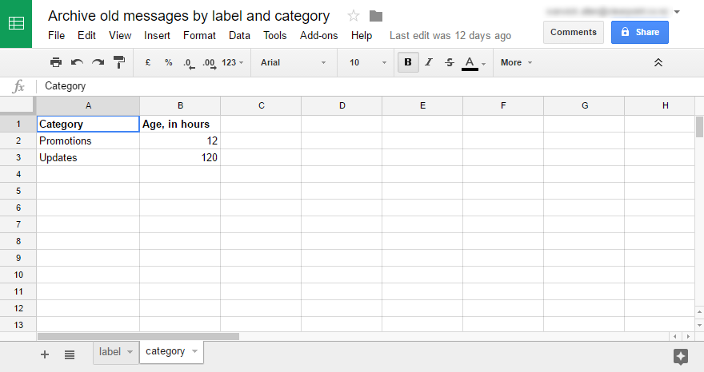
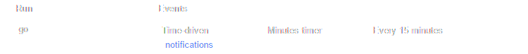

# GMail-Archive-old-messages-by-label-and-category

#### Author

Warwick Allen

#### Date

December 2016

#### Licence

MIT

## Purpose

Provides a mechanism to archive messages in GMail when they reach a
certain age according to their label or category.

## Setup

1. Create a Google Script project called "Archive old messages by label
   and category".

1. Create a file in the project called
   "archiveOldMessagesByLabelAndCategory" and copy into it the contents
   of the "archiveOldMessagesByLabelAndCategory.gs" file in this
   repository.

1. Create a Google Sheet called "Archive old messages by label and
   category".

1. Create two tabs in the sheet: "labels" and "categories".  Each tab
   should have two columns. The first column should have either "Label"
   or "Category" as the heading; the second column should have "Age, in
   hours" as the heading.

   Examples:

   

   

1. Back in the project, create a time-drive trigger to periodically
   invoke the "go()" function.

   Example:

   

# Usage 

Set up GMail filters to add labels or to categorise incoming mail to
match the rules defined in the "Archive old messages by label and
category" Google sheet.
